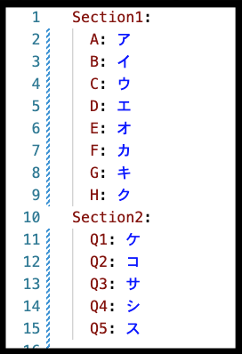
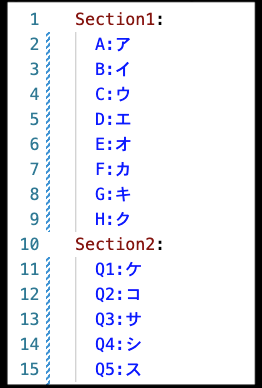

# DataScience

問1,2,3に解答してください。それぞれ[no1](no2), [no2](no2), [no3](no3)にあります。

## 回答形式

### 短答問題(no1)について

短答問題の回答形式確認のテストでは、与えられた`answer.yaml`のキーを勝手に変更したり、削除しない限りは通ります。ただ、1点注意として、`key: value` のようにコロンの後には半角スペースを必ず入れるようにしてください。入れない場合、正しく採点されない場合があります。

（良い例）

（悪い例）

### コーディング問題(no2, no3)について

ディープラーニングのコーディング問題の回答形式確認テストでは、それぞれの問題で以下の様なテストを行います。

#### no2
- 採点対象のcsvファイルが存在するか
- 含まれているべきカラムが全て含まれているか

#### no3
- 採点対象のcsvファイルが存在するか
- 行数が正しいか
- 含まれているべきカラムが全て含まれているか
