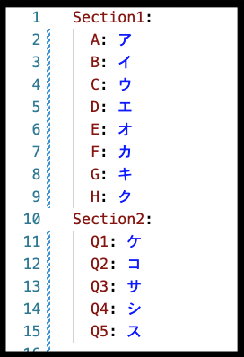
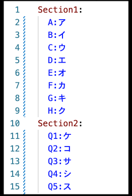

# Docker

[問1](no1)に解答してください。

## 回答形式

### 短答問題(no1)について

短答問題の回答形式確認のテストでは、与えられた`answer.yaml`のキーを勝手に変更したり、削除しない限りは通ります。ただ、1点注意として、`key: value` のようにコロンの後には半角スペースを必ず入れるようにしてください。入れない場合、正しく採点されない場合があります。

（良い例）

（悪い例）

