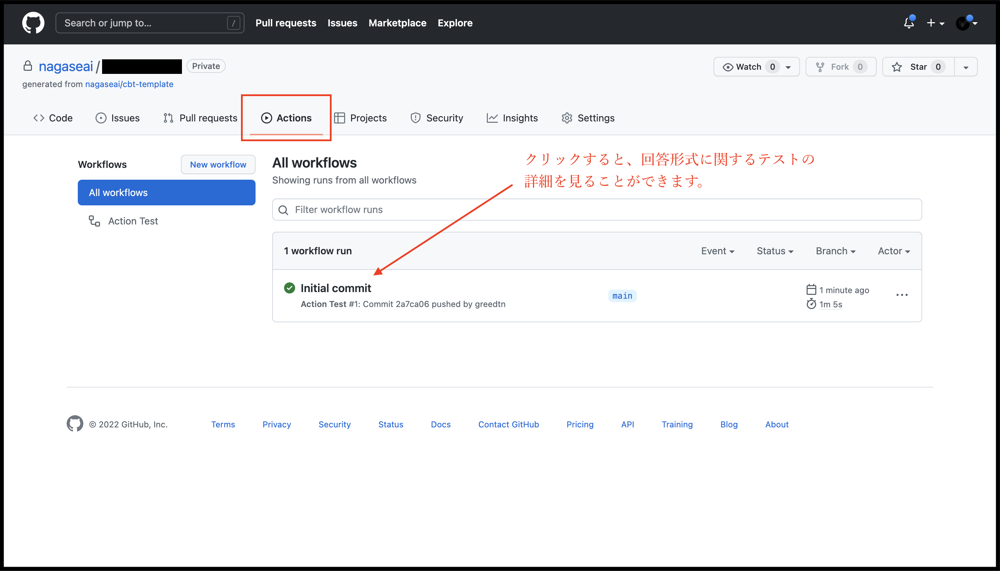
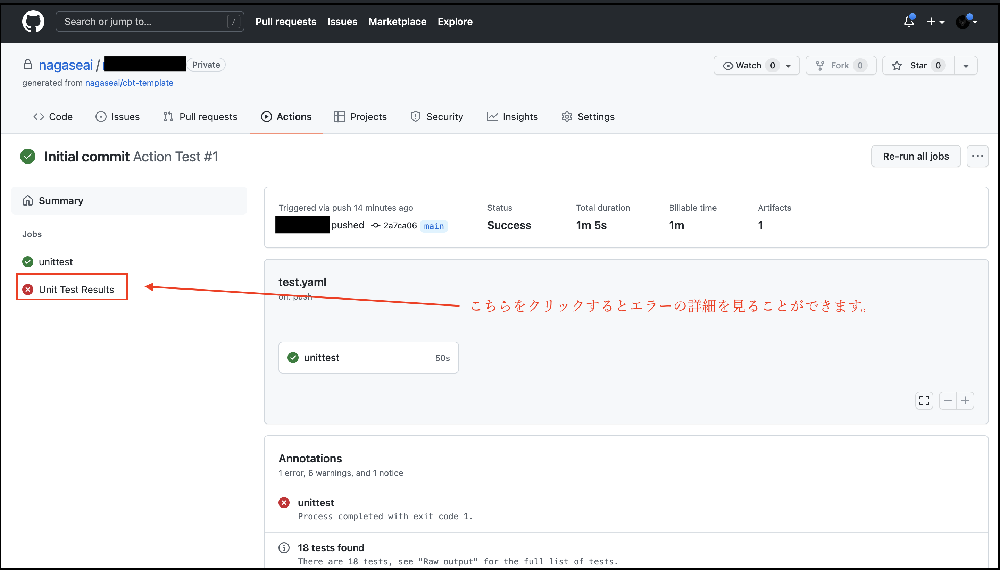
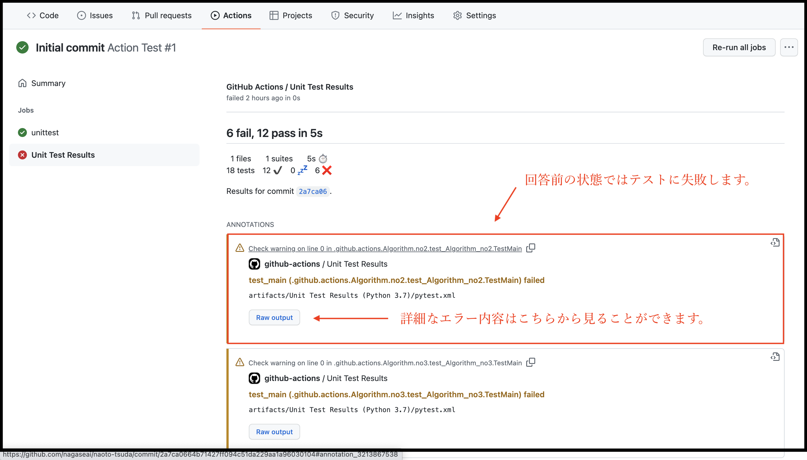
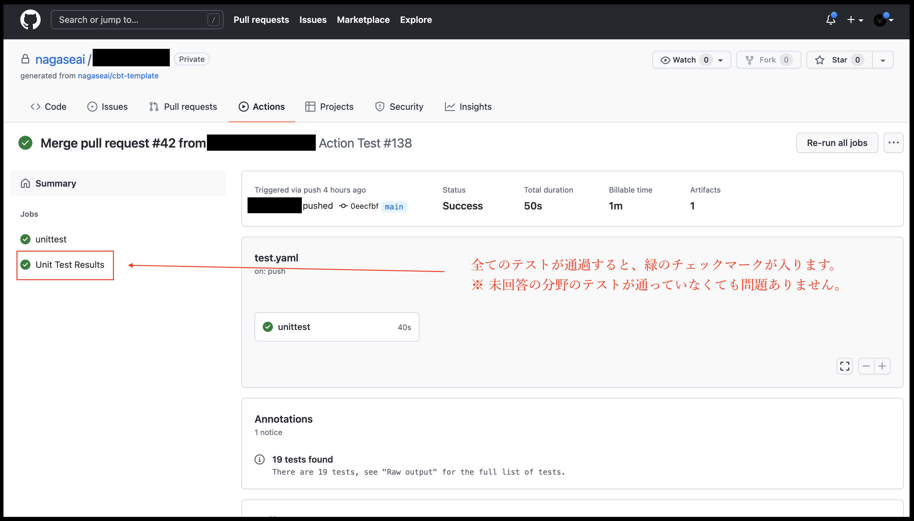
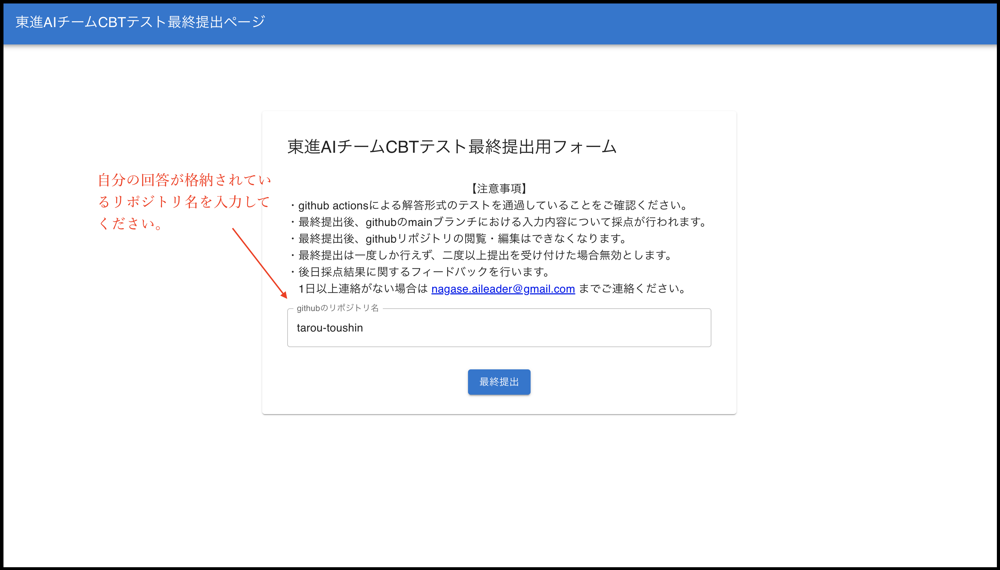
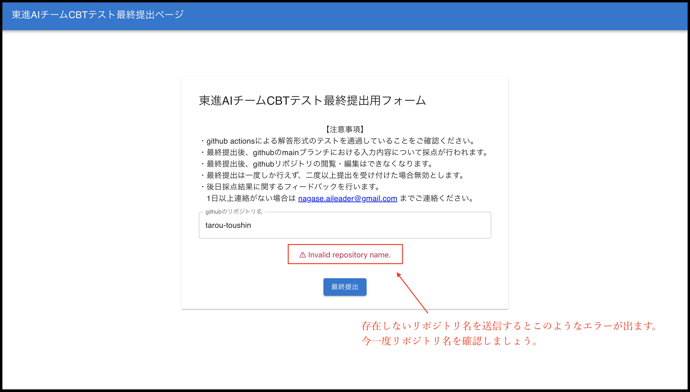

# 東進 CBT

以下の説明をよく読んで回答してください。

## ルール
- 提出期限は**3日後の18時まで**となります。提出が遅れた場合には0点扱いになる場合があるので、余裕を持って提出してください。万が一体調不良等で提出が遅れる場合は早めにご連絡ください。
- 回答にあたり、書籍やWEBサイト等を参照しても構いませんが、**回答は必ず1人で行ってください。** 不正行為が発覚した場合は、不採用となる場合がございます。
- 問題の不備等を発見した場合はご連絡ください。
- 自分の応募するチームが指定する分野の問題を解いてください。対応表は以下になります。

## 必須分野

|  問題分野  |  IT・エンジニアチーム  |  AIチーム  | データエンジニアリング | データサイエンス |
| :----: | :----: | :----: | :----: | :----: |
|  [Algorithm](Algorithm)  |  ◯  |  ◯  |  ◯  |  ◯  |
|  [AmazonWebService](AmazonWebService)  |  ◯  |  x  |  x  |  x  |
|  [DatabaseManagementSystem](DatabaseManagementSystem)  |  ◯  |  x  |  ◯  |  x  |
|  [DataScience](DataScience)  |  x  |  ◯  |  ◯  |  ◯  |
|  [DeepLearning](DeepLearning)  |  x  |  ◯  |  x  |  x  |
|  [Docker](Docker)  |  ◯  |  ◯  |  x  |  x  |
|  [Git](Git)  |  ◯  |  ◯  |  ◯  |  ◯  |
|  [Linux](Linux)  |  ◯  |  ◯  |  x  |  x  |
|  [SoftwareArchitecture](SoftwareArchitecture)  |  ◯  |  ◯  |  x  |  x  |
|  [WebApplication](WebApplication)  |  ◯  |  x  |  x  |  x  |

◯：必須分野, x：解く必要がない問題（採点対象外）

## 問題の種類

各分野には以下の2種類の問題が存在します。

1. 短答問題（各分野のno1に相当）
2. コーディング問題（各分野のno2以上に相当）

## 回答手順

### リポジトリのclone

まずはこのリポジトリをローカルにクローンしてください。通信プロトコルはSSHを使用することを推奨します。

### 回答

解くべき問題のフォルダにある `answer.yaml` や `main.py` に解答を記述してください。1通り回答が終了したら、mainブランチにpushしてください。mainブランチにpushした際に Github Actions上で回答形式のテストが始まります。

### 回答形式の確認

以下の画像の`Actions`というタブを押すと、回答形式のテスト結果を見ることができます。

最新コミットをクリックして、回答形式が正しいか確認しましょう。各問題でテストできる回答形式は各問題のフォルダ内の`README.md`に記載されていますので、そちらをご確認ください。Github Actionsでエラーが出ている状態で提出しても、エラーが出ている部分の得点は0点となる可能性が高いですが、他の部分の採点は行われますので、解決できない場合エラーがある場合でも提出してください。

回答前の状態では、短答問題についてはエラーが出ませんが、以下の様にコーディング問題に関してはエラーが出ています。回答した問題については、テストを通過するか確認し、失点を防ぎましょう。

全てのテストが通過すると、以下の画像のように緑のチェックマークが付きます。ただ、必須分野でない分野の問題のテストは通過していなくても問題ありません。※ 回答形式のテストが全て通ったからといって満点になるわけではなく、**Github Actions上のテストはあくまで回答形式が正しいかをテストしているだけ** であることに注意してください。

## 提出方法

問題の回答が終わったら、[こちらのサイト](https://d6dj0pw8uxtdr.cloudfront.net/index.html)に
アクセスし、自分のリポジトリ名を入力して送信してください。それをもって提出完了とします。

以下の様なエラーが出た場合はリポジトリ名を間違えている可能性が高いので、再度ご確認をお願いします。

